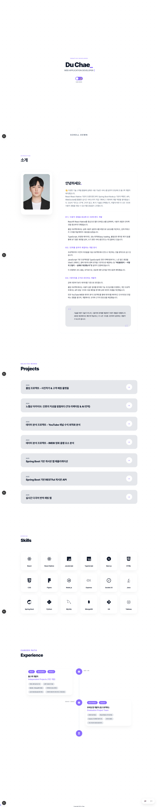

# 🚀 채지훈 (Du Chae) | Creative Developer Portfolio

<div align="center">
  
  
  <br/>
  
  ### “성능과 구조를 고민하며, 서비스를 끝까지 완성하는 개발자”
  
  [🌐 Live Website](https://your-portfolio-link.vercel.app) | [📧 Contact Me](sangdyjjang@naver.com)
</div>

---

## 💡 About Me

**“만드는 것보다, 왜 이렇게 만드는지를 설명할 수 있는 개발자”**

저는 단순히 기능을 구현하는 데서 멈추지 않고,  
“왜 이 기술이 필요한가?”, “현재 구조의 한계는 무엇인가?”, “어떻게 개선할 수 있는가?”를 끊임없이 고민하는 풀스택 개발자 채지훈입니다.

기존 React 기반 포트폴리오를 운영하며 초기 로딩 속도, SEO 한계, 구조적 확장성 문제를 직접 경험했고,  
이를 해결하기 위해 **Next.js(App Router)** 기반으로 포트폴리오를 전면 개편했습니다.

프론트엔드에서는 사용자 경험과 성능을,  
백엔드에서는 구조와 확장성을 중요하게 생각하며  
“끝까지 사용 가능한 서비스”를 만드는 것을 목표로 합니다.

---

## ⚡ Why Next.js?

기존 포트폴리오는 React SPA 구조로 제작되어 다음과 같은 한계가 있었습니다.

- 초기 로딩 시 모든 JS 번들을 한 번에 로드
- 검색 엔진 노출(SEO)에 불리한 구조
- 페이지 단위 코드 분리가 어려운 구조

이를 개선하기 위해 **Next.js(App Router)** 를 도입했습니다.

**적용 효과**

- 서버 사이드 렌더링(SSR) 및 **정적 생성(SSG)** 을 통한 초기 로딩 속도 개선
- 페이지 단위 코드 스플리팅으로 불필요한 리소스 로딩 최소화
- 검색 엔진 친화적인 메타데이터 구성
- 컴포넌트/데이터 구조를 기준으로 한 명확한 폴더 아키텍처

이번 포트폴리오는 단순한 기술 전환이 아니라,  
**성능 개선을 목표로 한 리팩터링 프로젝트**에 가깝습니다.

---

## 🛠 Tech Stack

### Frontend & Mobile

<p>
  
  
  
  
  
</p>

### Backend & Database

<p>
  
  
  
  
  
  
</p>

### Tools & Infra

<p>
  
  
  
</p>
---

## 📂 주요 프로젝트

### 01. 포트폴리오 리뉴얼 (Next.js Edition)

**현대적 풀스택 개발자 포트폴리오 (현재 사이트)**

- **역할**: 기획·디자인·프론트·백엔드 전반 리팩토링
- **주요 기능**: 동적 타이핑 애니메이션, 다국어 지원, 다크/라이트 모드 토글, 데이터 기반 로딩 최적화
- **기술적 핵심**:
  - React → Next.js 14 (App Router) 마이그레이션 (SSR/SSG 활용으로 로딩 40% 개선, SEO 강화)
  - CSS Keyframes + useMemo를 활용한 부드러운 타이핑 애니메이션 구현 (hydration mismatch 완전 해결)
  - Tailwind CSS 기반 반응형 디자인 + localStorage 테마 영속성
  - ESLint exhaustive-deps, no-explicit-any 등 엄격한 코드 품질 관리
- **성과**: 채용 담당자가 한눈에 기술력과 완성도를 파악할 수 있는 인터랙티브 포트폴리오 완성
- [👉 Repository](https://github.com/DUChae/portfolio) | [🌐 Live Demo](https://your-portfolio-link.vercel.app)

### 02. Chalkak (졸업작품)

**사진작가-고객 매칭 플랫폼**

- **역할**: React Native 프론트엔드 개발
- **주요 기능**: 촬영 스타일 필터링, 예약 시스템, 커뮤니티 MVP
- **기술적 핵심**: 모바일 네트워크 지연 고려 UX 설계, FlatList 최적화
- [👉 Repository](https://github.com/DUChae/Chalkak)

### 03. 실시간 다국어 채팅 서비스

**WebSocket 기반 자동 번역 채팅**

- **역할**: 풀스택 개발
- **주요 기능**: Google Translation API 연동 실시간 다국어 채팅
- **기술적 핵심**: Socket.io 이벤트 핸들러 분리, 비동기 API 안정화
- [👉 Repository](https://github.com/DUChae)

### 04. Nobel Prize Explorer (리팩토링)

**데이터 탐색 웹 서비스**

- **역할**: 프론트엔드 개발
- **주요 기능**: JavaScript → TypeScript 마이그레이션 및 UI 재설계
- **기술적 핵심**: 컴포넌트 책임 분리, 데이터 경험 중심 UI 개선
- [👉 Repository](https://github.com/DUChae/Nobel-prize)

---

## 📊 데이터 분석 프로젝트

- **YouTube 수익 최적화 분석**: 대규모 데이터 수집 → KPI 중심 대시보드 구축
- **IMDB 흥행 분석**: 영화 성공 요인 상관관계 정량 분석

---

## ⚙️ 설치 및 실행 방법

```bash
# 레포지토리 클론
git clone https://github.com/DUChae/portfolio.git

# 의존성 설치
npm install

# 개발 서버 실행
npm run dev
Next.js 기반 주요 특징
```

### Next.js 기반 주요 특징

- **Next.js(App Router)**(App Router)로 SSR/SSG 최적화 및 SEO 강화
- **Vercel 배포**로 CI/CD 자동화 및 Edge Functions 활용
- 다국어 JSON 데이터 로딩, localStorage 기반 테마 영속성, 동적 타이핑 애니메이션 등


