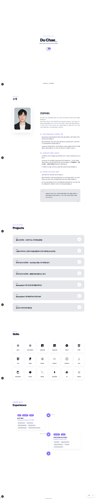

# 🚀 Jihoon Chae | Full-stack Developer Portfolio

<div align="center">
  
  
  <br/>
  
  ### "A developer who builds end-to-end services with data-driven decisions."
  
  [🌐 Live Website](https://your-portfolio-link.vercel.app) | [📧 Contact Me](sangdyjjang@naver.com) 
</div>

---

## 💡 About Me

**"I don't just build; I solve problems."**
저는 단순히 기능을 구현하는 것을 넘어, "왜 이 기술이 필요한가?"를 끊임없이 고민하는 풀스택 개발자 채지훈입니다.
React와 React Native를 활용한 사용자 중심의 UI 설계부터, Spring Boot와 Node.js 기반의 안정적인 백엔드 구축까지 서비스의 전 과정을 책임집니다.

- **User-Centric**: 실제 사용자 피드백과 데이터를 근거로 UX를 개선합니다.
- **Completionist**: 이전 프로젝트의 아쉬움을 다음 프로젝트에서 반드시 해결(Refactoring)합니다.
- **Data-Driven**: YouTube/IMDB 데이터 분석 경험을 바탕으로 기술적 근거를 숫자로 증명합니다.

---

## 🛠 Tech Stack

### Frontend & Mobile

<p>
  
  
  
  
  
</p>

### Backend & Database

<p>
  
  
  
  
  
  
</p>

---

## 📂 Featured Projects

### 01. Chalkak (Graduation Project)

**Photographer & Client Matching Platform**

- **Role**: Frontend Developer (React Native)
- **Key Feature**: 촬영 스타일 필터링, 예약 시스템, 커뮤니티 MVP 개발.
- **Technical Insight**: 모바일 네트워크 지연을 고려한 UX 처리 및 FlatList 최적화.
- [👉 Repository](https://github.com/DUChae/Chalkak)

### 02. Real-time Multi-language Chat

**WebSocket-based Translation Chatting Service**

- **Role**: Full-stack Developer
- **Key Feature**: Google Translation API를 연동한 실시간 다국어 자동 번역 채팅.
- **Technical Insight**: Socket.io 이벤트 핸들러 분리 및 비동기 API 처리 안정화.
- [👉 Repository](https://github.com/DUChae)

### 03. Nobel Prize Explorer (Refactoring)

**Data Exploration Web Service**

- **Role**: Frontend Developer
- **Key Feature**: JavaScript 프로젝트를 TypeScript로 리팩터링하여 타입 안정성 확보.
- **Technical Insight**: 컴포넌트 책임 분리 및 데이터 경험(Data Experience) 중심의 UI 재설계.
- [👉 Repository](https://github.com/DUChae/Nobel-prize)

---

## 📊 Data Analysis Projects

- **YouTube Revenue Optimization**: 대규모 데이터 수집 및 KPI 중심 시각화 대시보드 구축.
- **IMDB Box Office Analysis**: 영화 흥행 요소의 상관관계 정량적 분석.

---

## ⚙️ Installation & Setup

```bash
# Clone this repository
git clone [https://github.com/DUChae/portfolio.git](https://github.com/DUChae/portfolio.git)

# Install dependencies
npm install

# Run the development server
npm start
```
